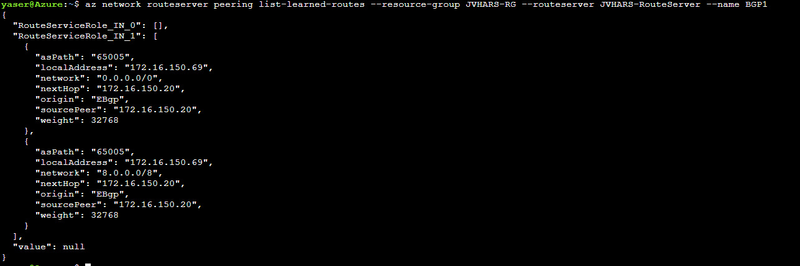

### Test Case: Advertisment 10K static routes to Azure Fortigate  with BGP

## Introduction
The aim of the test here is to check and control any possible impact on Forigate VM in azure due to huge number of advertised routes.
On the other hands, we will summrize those routes on Forigate VM and advertise the summerization route to ASR.

## Test Scenario 

Before starting any test, let's check the memory and cpu usage on FG VM.

JVHARS-FGT-A # get system performance status 
CPU states: 0% user 0% system 0% nice 100% idle 0% iowait 0% irq 0% softirq
CPU0 states: 0% user 0% system 0% nice 100% idle 0% iowait 0% irq 0% softirq
CPU1 states: 0% user 0% system 0% nice 100% idle 0% iowait 0% irq 0% softirq
CPU2 states: 0% user 0% system 0% nice 100% idle 0% iowait 0% irq 0% softirq
CPU3 states: 0% user 0% system 0% nice 100% idle 0% iowait 0% irq 0% softirq
Memory: 8197816k total, 1192444k used (14.5%), 6741196k free (82.2%), 264176k freeable (3.3%)
Average network usage: 28 / 46 kbps in 1 minute, 41 / 72 kbps in 10 minutes, 35 / 750 kbps in 30 minutes
Average sessions: 26 sessions in 1 minute, 35 sessions in 10 minutes, 34 sessions in 30 minutes
Average session setup rate: 0 sessions per second in last 1 minute, 1 sessions per second in last 10 minutes, 0 sessions per second in last 30 minutes
Virus caught: 0 total in 1 minute
IPS attacks blocked: 0 total in 1 minute
Uptime: 0 days,  0 hours,  14 minutes

We will begin with advertising 10K static routes from on-promise Fortigate to Forigate VM in azure.

JVHARS-FGT-A # get router info routing-table bgp 
Routing table for VRF=0
B       8.0.0.0/28 [20/0] via 169.254.2.10 (recursive via ARSAzure tunnel 10.0.0.1), 00:03:38
B       8.0.0.16/28 [20/0] via 169.254.2.10 (recursive via ARSAzure tunnel 10.0.0.1), 00:03:38
B       8.0.0.32/28 [20/0] via 169.254.2.10 (recursive via ARSAzure tunnel 10.0.0.1), 00:03:38
B       8.0.0.48/28 [20/0] via 169.254.2.10 (recursive via ARSAzure tunnel 10.0.0.1), 00:03:38
B       8.0.0.64/28 [20/0] via 169.254.2.10 (recursive via ARSAzure tunnel 10.0.0.1), 00:03:38
B       8.0.0.80/28 [20/0] via 169.254.2.10 (recursive via ARSAzure tunnel 10.0.0.1), 00:03:38
B       8.0.0.96/28 [20/0] via 169.254.2.10 (recursive via ARSAzure tunnel 10.0.0.1), 00:03:38
B       8.0.0.112/28 [20/0] via 169.254.2.10 (recursive via ARSAzure tunnel 10.0.0.1), 00:03:38
B       8.0.0.128/28 [20/0] via 169.254.2.10 (recursive via ARSAzure tunnel 10.0.0.1), 00:03:38
B       8.0.0.144/28 [20/0] via 169.254.2.10 (recursive via ARSAzure tunnel 10.0.0.1), 00:03:38
B       8.0.0.160/28 [20/0] via 169.254.2.10 (recursive via ARSAzure tunnel 10.0.0.1), 00:03:38
B       8.0.0.176/28 [20/0] via 169.254.2.10 (recursive via ARSAzure tunnel 10.0.0.1), 00:03:38
B       8.0.0.192/28 [20/0] via 169.254.2.10 (recursive via ARSAzure tunnel 10.0.0.1), 00:03:37
B       8.0.0.208/28 [20/0] via 169.254.2.10 (recursive via ARSAzure tunnel 10.0.0.1), 00:03:37
B       8.0.0.224/28 [20/0] via 169.254.2.10 (recursive via ARSAzure tunnel 10.0.0.1), 00:03:37
B       8.0.0.240/28 [20/0] via 169.254.2.10 (recursive via ARSAzure tunnel 10.0.0.1), 00:03:37
B       8.0.1.0/28 [20/0] via 169.254.2.10 (recursive via ARSAzure tunnel 10.0.0.1), 00:03:37
B       8.0.1.16/28 [20/0] via 169.254.2.10 (recursive via ARSAzure tunnel 10.0.0.1), 00:03:37
B       8.0.1.32/28 [20/0] via 169.254.2.10 (recursive via ARSAzure tunnel 10.0.0.1), 00:03:37
B       8.0.1.48/28 [20/0] via 169.254.2.10 (recursive via ARSAzure tunnel 10.0.0.1), 00:03:37
B       8.0.1.64/28 [20/0] via 169.254.2.10 (recursive via ARSAzure tunnel 10.0.0.1), 00:03:37
B       8.0.1.80/28 [20/0] via 169.254.2.10 (recursive via ARSAzure tunnel 10.0.0.1), 00:03:37
B       8.0.1.96/28 [20/0] via 169.254.2.10 (recursive via ARSAzure tunnel 10.0.0.1), 00:03:37
B       8.0.1.112/28 [20/0] via 169.254.2.10 (recursive via ARSAzure tunnel 10.0.0.1), 00:03:37
B       8.0.1.128/28 [20/0] via 169.254.2.10 (recursive via ARSAzure tunnel 10.0.0.1), 00:03:37
B       8.0.1.144/28 [20/0] via 169.254.2.10 (recursive via ARSAzure tunnel 10.0.0.1), 00:03:37
B       8.0.1.160/28 [20/0] via 169.254.2.10 (recursive via ARSAzure tunnel 10.0.0.1), 00:03:37
B       8.0.1.176/28 [20/0] via 169.254.2.10 (recursive via ARSAzure tunnel 10.0.0.1), 00:03:37
B       8.0.1.192/28 [20/0] via 169.254.2.10 (recursive via ARSAzure tunnel 10.0.0.1), 00:03:37
B       8.0.1.208/28 [20/0] via 169.254.2.10 (recursive via ARSAzure tunnel 10.0.0.1), 00:03:37
B       8.0.1.224/28 [20/0] via 169.254.2.10 (recursive via ARSAzure tunnel 10.0.0.1), 00:03:37
B       8.0.1.240/28 [20/0] via 169.254.2.10 (recursive via ARSAzure tunnel 10.0.0.1), 00:03:37
B       8.0.2.0/28 [20/0] via 169.254.2.10 (recursive via ARSAzure tunnel 10.0.0.1), 00:03:37
B       8.0.2.16/28 [20/0] via 169.254.2.10 (recursive via ARSAzure tunnel 10.0.0.1), 00:03:37
B       8.0.2.32/28 [20/0] via 169.254.2.10 (recursive via ARSAzure tunnel 10.0.0.1), 00:03:37
B       8.0.2.48/28 [20/0] via 169.254.2.10 (recursive via ARSAzure tunnel 10.0.0.1), 00:03:37
--More-- 

JVHARS-FGT-A # get route info bgp summary 
VRF 0 BGP router identifier 172.16.150.20, local AS number 65005
BGP table version is 495
2 BGP AS-PATH entries
0 BGP community entries

Neighbor      V         AS MsgRcvd MsgSent   TblVer  InQ OutQ Up/Down  State/PfxRcd
169.254.2.10  4      65004    5457    5430      485    0    0 01:29:44     9999
172.16.150.68 4      65515    5497    7390        0    0    0    never Idle       
172.16.150.69 4      65515    5500    7365        0    0    0    never Active     

Total number of neighbors 3

We can see a slight increase in memory usage after routes advertisement.

JVHARS-FGT-A # get system performance status 
CPU states: 0% user 0% system 0% nice 100% idle 0% iowait 0% irq 0% softirq
CPU0 states: 0% user 0% system 0% nice 100% idle 0% iowait 0% irq 0% softirq
CPU1 states: 0% user 0% system 0% nice 100% idle 0% iowait 0% irq 0% softirq
CPU2 states: 0% user 0% system 0% nice 100% idle 0% iowait 0% irq 0% softirq
CPU3 states: 0% user 0% system 0% nice 100% idle 0% iowait 0% irq 0% softirq
Memory: 8197816k total, 1269472k used (15.5%), 6625624k free (80.8%), 302720k freeable (3.7%)
Average network usage: 32 / 154 kbps in 1 minute, 31 / 167 kbps in 10 minutes, 32 / 247 kbps in 30 minutes
Average sessions: 31 sessions in 1 minute, 29 sessions in 10 minutes, 32 sessions in 30 minutes
Average session setup rate: 2 sessions per second in last 1 minute, 1 sessions per second in last 10 minutes, 1 sessions per second in last 30 minutes
Virus caught: 0 total in 1 minute
IPS attacks blocked: 0 total in 1 minute
Uptime: 0 days,  1 hours,  41 minutes

The total BGP memory usage is around 6.5MB.

JVHARS-FGT-A # get router info bgp memory 
==================== XMEM ALLOCATOR INFO =======================
(1)     0x7f3605a7ded0:    4        1474       65536       1   0
(2)     0x7f3605a7de20:    8       25580       65536       1   0
(3)     0x7f3605a7dd70:   12        6682       65536       1   0
(4)     0x7f3605a7dcc0:   16       54116       65536       1   0
(5)     0x7f3605a7dc10:   20        2034       65536       1   0
(6)     0x7f3605a7db60:   24        2824       65536       1   0
(7)     0x7f3605a7dab0:   28          52       65536       1   0
(8)     0x7f3605a7da00:   32        7360       65536       1   0
(9)     0x7f3605a7d950:   36          70       65536       1   0
(10)    0x7f3605a7d8a0:   40        2200       65536       1   0
(11)    0x7f3605a7d7f0:   44           0           0       0   0
(12)    0x7f3605a7d740:   48        2496       65536       1   0
(13)    0x7f3605a7d690:   64     1440200     2818048      43   0
(14)    0x7f3605a7d5e0:   80        1248      196608       3   1
(15)    0x7f3605a7d530:   96       10352       65536       1   0
(16)    0x7f3605a7d480:  112         628       65536       1   0
(17)    0x7f3605a7d3d0:  128        3840       65536       1   0
(18)    0x7f3605a7d320:  160     4327000     4849664      74   0
(19)    0x7f3605a7d270:  192         552       65536       1   0
(20)    0x7f3605a7d1c0:  224         224       65536       1   0
(21)    0x7f3605a7d110:  256        7168       65536       1   0
(22)    0x7f3605a7d060:  384        7424       65536       1   0
(23)    0x7f3605a7ced0:  512        3544       65536       1   0
(24)    0x7f3605a7ce20:  640        1576       65536       1   0
(25)    0x7f3605a7cd70:  768           0           0       0   0
(26)    0x7f3605a7ccc0:  896         824       65536       1   0
(27)    0x7f3605a7cc10: 1024        2048       65536       1   0
(28)    0x7f3605a7cb60: 2048           0       65536       1   1
(29)    0x7f3605a7cab0: 4096       32960       65536       1   0
(30)    0x7f3605a7ca00: 8192      106664      196608       3   1
(31)    0x7f3605a7c950:16384           0           0       0   0
(32)    0x7f3605a7c8a0:32768           0           0       0   0
----------------------------------------------------------------
Total:                           6051140     9633792     147   3
----------------------------------------------------
(1)     0x7f3605a7b360:           161912      163840
(2)     0x7f3605a7b6c0:           164576      167936
(3)     0x7f3605a7b7e0:           161912      163840
Total:                            488400      495616
----------------------------------------------------
Summary: 6539540, 10129408, 8, 6
=================== END OF XMEM ALLOCATOR INFO =================

Timer: pending 12, added 13509, expired 10383, deleted 3114

Timer running time: 0 - 0, 0, do_prof 0

bgp memory usage
Memory type                          Alloc count   Alloc bytes  
=================================== ============= ===============
BGP structure                     :           2          323824
BGP VR structure                  :           2             656
BGP global structure              :           1             112
BGP peer                          :           5           20080
BGP peer notification data        :           2              24
BGP RIB                           :       10006         1600960
BGP network                       :           1              24
BGP adjacency                     :       20006         1280384
BGP adjacency path                :           3             192
BGP advertise                     :           3             216
BGP advertise attr                :           5             160
BGP attribute                     :          11            1584
BGP aspath                        :           3              96
BGP aspath seg                    :           2              12
BGP aspath str                    :           3             153
BGP as list master                :           1              32
Community list handler            :           1              32
BGP nexthop cache                 :           2              48
BGP Damp Reuse List Array         :           2            8192
BGP table                         :          66             528
BGP node                          :       20007         2720952
----------------------------------- ------------- ---------------
Temporary memory                  :        5510          183389
Hash                              :          10             400
Hash index                        :          10           81920
Hash bucket                       :          36             864
Thread master                     :           1             224
Thread                            :          22            3344
Epoll data                        :          11             880
Link list                         :          44            1760
Link list node                    :          48            1152
Show                              :           1             520
Show page                         :           3           12336
Show server                       :           1              64
Prefix IPv4                       :          17             136
Prefix IPv6                       :           3              60
Route table                       :          11             176
Route node                        :         106           10176
Vector                            :        2815           45040
Vector index                      :        2815           48944
Host config                       :           1               2
Message of The Day                :           1             100
IMI Client                        :           1             824
VTY master                        :           1              40
VTY if                            :          18            6768
VTY connected                     :          13             728
Stream sock CB                    :           3             552
Circular queue buf                :           3           12408
Message handler                   :           2             208
NSM Client Handler                :           1          164576
NSM Client                        :           1            2528
NSM Nexthop                       :           2             176
Host                              :           2             256
Log information                   :           2              96
Context                           :           1             472
SYS ZEBOS IPC Server              :           1             160
----------------------------------- ------------- ---------------
bgp proto specifc allocations :      5958261 B
bgp generic allocations       :       581279 B
bgp total allocations         :      6539540 B

Thread delay statistics:
ep wait delay: max=10 happened at 1 seconds ago
execution delay: max=20 happened at 511 seconds ago

Keepalive thread:
Timer: pending 1, added 17279, expired 14730, deleted 2548

Now we will do summrization of the 10K static routes on FG vm. The summrization IP address should be 8.0.0.0/8.
you can check the link below for more info.

JVHARS-FGT-A # config router bgp 

JVHARS-FGT-A (bgp) # show
config router bgp
    set as 65005
    set keepalive-timer 1
    set holdtime-timer 3
    set ebgp-multipath enable
    set graceful-restart enable
    config aggregate-address
        edit 1
            set prefix 8.0.0.0 255.0.0.0
            set summary-only enable
        next
    end
    config neighbor
        edit "172.16.150.68"
            set capability-default-originate enable
            set ebgp-enforce-multihop enable
            set soft-reconfiguration enable
            set interface "port2"
            set remote-as 65515
        next
        edit "172.16.150.69"
            set capability-default-originate enable
            set ebgp-enforce-multihop enable
            set soft-reconfiguration enable
            set interface "port2"
            set remote-as 65515
        next
        edit "169.254.2.10"
            set interface "ARSAzure"
            set remote-as 65004
        next
    end
    config network
        edit 1
            set prefix 8.0.0.0 255.0.0.0
        next
    end
    config network6
        edit 1
            set prefix6 ::/128
        next
    end
    config redistribute "connected"
    end
    config redistribute "rip"
    end
    config redistribute "ospf"
    end
    config redistribute "static"
    end
    config redistribute "isis"
    end
    config redistribute6 "connected"
    end
    config redistribute6 "rip"
    end
    config redistribute6 "ospf"
    end
    config redistribute6 "static"
    end
    config redistribute6 "isis"
    end
end

After that we will verify the advertised routes to ARS through the following command:

JVHARS-FGT-A # get router info bgp neighbors 172.16.150.68 advertised-routes
VRF 0 BGP table version is 4, local router ID is 172.16.150.20
Status codes: s suppressed, d damped, h history, * valid, > best, i - internal
Origin codes: i - IGP, e - EGP, ? - incomplete

   Network          Next Hop            Metric LocPrf Weight RouteTag Path
*> 0.0.0.0/0        172.16.150.20                 100  32768        0 i <-/->
*> 8.0.0.0          172.16.150.20                      32768        0 i <-/->

Total number of prefixes 2

We can see double check also on ARS side
yaser@Azure:~$ az network routeserver peering list-learned-routes --resource-group JVHARS-RG --routeserver JVHARS-RouteServer --name BGP1
{
  "RouteServiceRole_IN_0": [
    {
      "asPath": "65005",
      "localAddress": "172.16.150.68",
      "network": "0.0.0.0/0",
      "nextHop": "172.16.150.20",
      "origin": "EBgp",
      "sourcePeer": "172.16.150.20",
      "weight": 32768
    },
    {
      "asPath": "65005",
      "localAddress": "172.16.150.68",
      "network": "8.0.0.0/8",
      "nextHop": "172.16.150.20",
      "origin": "EBgp",
      "sourcePeer": "172.16.150.20",
      "weight": 32768
    }
  ],

